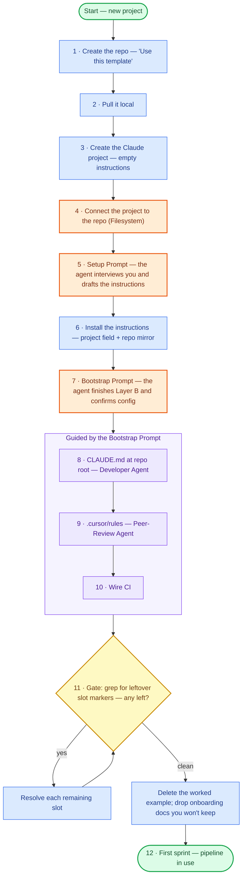

# Diagram source — How to SET UP the workflow (no project → running pipeline)

*Mermaid flowchart mirroring the steps in `SETUP.md`. Renders directly and is clean source for an agent to build a diagram from.*

**Legend:** rounded = start/end · rectangle = a step · diamond = a gate.
**Colors (intentional — keep them):** 🟢 green = start/finish · 🔵 blue = a step you do · 🟠 orange = the load-bearing steps (connect the repo + the two agent prompts) · 🟣 purple = the bootstrap-guided config block · 🟡 yellow = the slot gate.

**Teaching note — the two prompts are the story.** The **Setup Prompt** (step 5) runs *before* the project has instructions: the agent interviews you and **writes its own instructions** by filling the template. The **Bootstrap Prompt** (step 7) runs *after* they're installed: the agent finishes Layer B and the rest of the config. The other orange step (4, connect the repo) is the one people forget — without it the agent can't read the template to do either.

**To have your agent build it:** paste this file (or the fenced block) with "build a flow diagram from this Mermaid, and keep the colors." Structure, branches, and palette are all encoded — the agent renders rather than infers.
