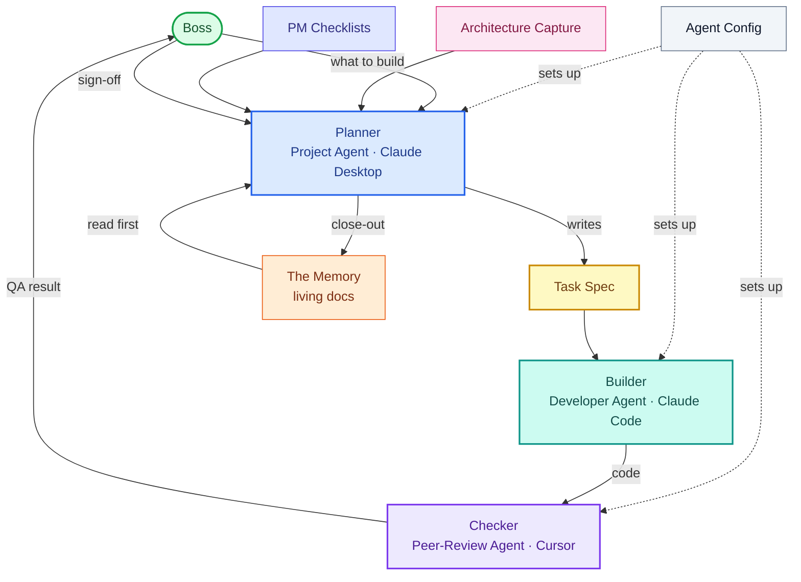

# Diagram source — System Map (SIMPLE / overview)

*The screenshare-friendly overview: the four personas and the five document groups as single boxes — no individual filenames. Use this to show the shape; use `system-map.md` when you want every document named.*

**Legend:** rounded = the human · boxes = agents and document groups.
**Colors (intentional — keep them):** 🟢 green = the Boss · 🔵 blue = Planner · 🟦 teal = Builder · 🟣 purple = Checker · 🟡 yellow = the task spec · ⬜ gray = agent config · 🟠 orange = the memory · 🩷 pink = architecture capture · 🔵 indigo = PM checklists.

**How to read it (one pass):** the **Boss** tells the **Planner** what to build. The Planner reads **the memory** first, leans on **architecture capture** and **PM checklists**, and writes a **task spec**. The **Builder** builds it; the **Checker** reviews it; the Boss signs off; the Planner's **close-out** writes everything back into the memory. **Agent config** is what sets up each of the three agents. That's the whole system on one slide.

**The five document groups:** Agent Config · Task Spec · The Memory · Architecture Capture · PM Checklists. (Open `system-map.md` for the full version that names every document inside these groups.)

**To have your agent build it:** paste this file (or the fenced block) with "build a diagram from this Mermaid, and keep the colors."
