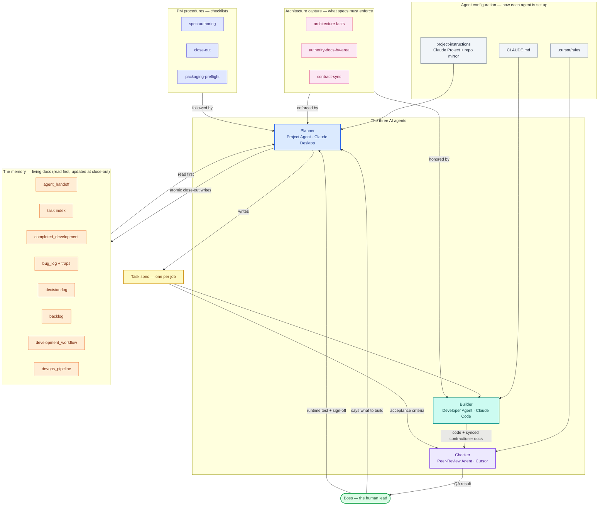

# Diagram source — System Map: documents, personas, and how they work together

*Mermaid diagram. Renders directly (GitHub / VS Code / Obsidian / mermaid.live) and is clean source for an agent to build a diagram from. This is the "everything at once" view — the four personas, the documents each one uses, and the arrows that connect them.*

**Legend:** rounded = the human · boxes = agents and documents · a box's color tells you what kind of thing it is.
**Colors (intentional — keep them):** 🟢 green = the Boss · 🔵 blue = Planner · 🟦 teal = Builder · 🟣 purple = Checker · 🟡 yellow = the task spec (the artifact that flows) · ⬜ gray = agent config · 🟠 orange = the memory (living docs) · 🩷 pink = architecture capture · 🔵 indigo = PM checklists.

**How to read it (the story in one pass):** the **Boss** tells the **Planner** what to build. The Planner is set up by its **project-instructions**, reads the **memory** and the **architecture facts** first, follows the **spec-authoring** checklist, and writes a **task spec**. The **Builder** (set up by `CLAUDE.md`) builds from that spec; the **Checker** (set up by `.cursor/rules`) reviews it against the spec's acceptance criteria and reports back. The Boss runtime-tests and signs off, then the Planner does the **close-out** — writing everything that happened back into the **memory**, so the next job starts from a true picture.

**Note:** this maps the *running-system* documents. The onboarding docs — `README`, `SETUP`, `INSTANTIATE`, `teaching/`, and these `diagrams/` — are the "getting started" set and sit outside the loop.

**To have your agent build it:** paste this file (or the fenced block) with "build a diagram from this Mermaid, and keep the colors." Every node, edge, group, and color is encoded — the agent renders rather than infers.
