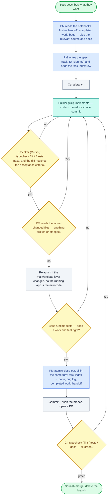

# Diagram source — How the workflow WORKS

*Mermaid flowchart. Renders directly and is clean source for an agent to build a diagram from. Shows how one job flows through the loop, including the checks that loop back.*

**Legend:** rounded = start/end · rectangle = an action · diamond = a check that can send the work back.
**Cast:** Boss = the human lead · Planner = Project Agent (Claude Desktop) · Builder = Developer Agent (Claude Code) · Checker = Peer-Review Agent (Cursor).
**Colors (intentional — keep them, they're by role):** 🟢 green = start/finish · 🔵 blue = the PM · 🟦 teal = the Builder · 🟡 yellow = a gate that can loop work back · ⬜ gray = a plain step.

**The through-line to point out when teaching:** the notebooks are read at the very start (top) and written at the close-out (`CO`) — the memory that carries between jobs. And the **four yellow diamonds** (Checker, PM read, Boss test, CI) are the four gates that can send work back — that's "green isn't proof; a human reads or runs the real thing," drawn as loop-backs.

**To have your agent build it:** paste this file (or the fenced block) with "build a flow diagram from this Mermaid, and keep the colors." Structure, branches, and the by-role palette are all encoded — the agent renders rather than infers.
