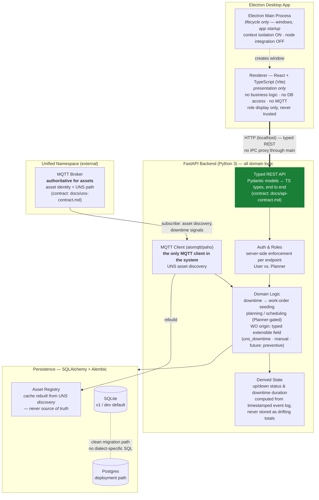

# CMMess — Proposed Architecture (temp doc)

> **Temporary** — pulled from `docs/architecture-facts.md` / DEC-004–007 for the Senior
> Architect. Not part of the living-doc set; safe to delete. As of 2026-07-22
> (post-T-001: backend `GET /health` exists; everything else is proposed).

**Legend:** green = exists today (T-001: `GET /health` through a typed Pydantic model). Everything else is proposed, constrained by `docs/architecture-facts.md`.

**The four foundational decisions (DEC-004–007):** separate-service topology (Electron shell + local FastAPI service, plain REST — no IPC data path) · server-side role enforcement (a hidden button is not an access control) · SQLAlchemy + Alembic dual-engine persistence (SQLite→Postgres without refactor) · live-broker UNS (backend is the sole MQTT client; UNS authoritative for assets).
